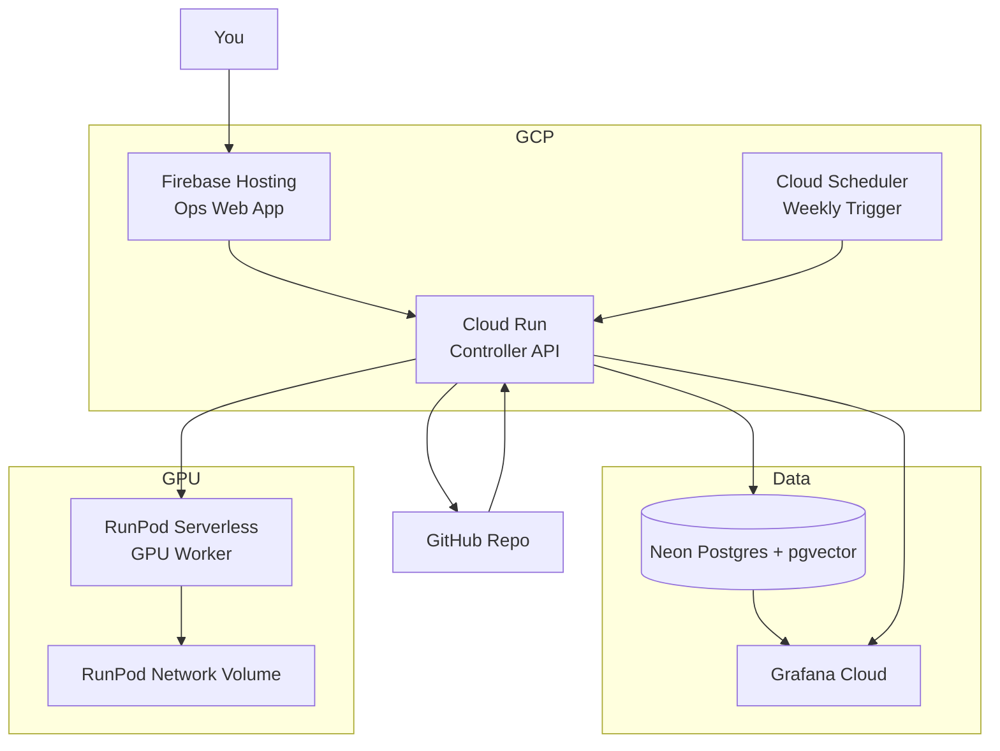

# V1 Architecture Proposal: Best Portfolio Version

Last updated: April 9, 2026

## Final Recommendation

Use this stack for V1:

- `Firebase Hosting` for the ops web app
- `Cloud Run` for the controller API
- `Cloud Scheduler` for the weekly trigger
- `Neon Postgres + pgvector` for the database
- `RunPod Serverless` for GPU translation and embeddings
- `Grafana Cloud` for observability dashboards

This is the best option for your project right now because it gives you:

- real `GCP` experience
- lower monthly cost than `Cloud SQL`
- a clean web demo surface
- a production-style architecture you can defend in interviews

## Why This Is Better Than Vercel

You already know `Vercel`, so using it again adds less portfolio value.

This version is stronger because:

- `Firebase Hosting + Cloud Run` shows you can work outside your familiar stack
- `Cloud Run` gives you real serverless backend experience on GCP
- `Cloud Scheduler` makes the weekly batch story cleaner than relying on GitHub Actions
- `Neon` keeps the database cost near zero for a once-a-week project

## Why Not Use Cloud SQL In V1

If this were a real company production system, `Cloud SQL Postgres` would be a clean choice.

For your current workload, it is not the best V1 choice because:

- it is always-on infrastructure
- it will cost much more than your weekly GPU usage
- your actual bottleneck is GPU translation, not database scale

So the best balance is:

- `GCP` for app hosting and orchestration
- `Neon` for low-cost managed Postgres
- `RunPod` for burst GPU inference

## Whole Architecture

## Runtime Flow

1. You open the web app on `Firebase Hosting`.
2. You trigger a run manually, or `Cloud Scheduler` triggers it once a week.
3. The `Cloud Run` controller reads changed `.mdx` files from GitHub.
4. The controller parses MDX and checks cache in `Neon Postgres`.
5. Only changed sections go to `RunPod`.
6. `RunPod` returns translations, embeddings, and token metadata.
7. The controller computes quality scores and stores results in Postgres.
8. The controller commits translated files back to GitHub.
9. The web app and `Grafana Cloud` show the run result, accuracy, tokens, latency, cost, and translated docs.

## What Each Technology Does

| Component | Role | Why this one |
|---|---|---|
| `Firebase Hosting` | Hosts your operations UI | GCP skill signal, low cost, easy deploy |
| `Cloud Run` | Hosts FastAPI orchestration layer | Scales to zero, production-friendly, strong GCP story |
| `Cloud Scheduler` | Weekly trigger | Better than cron on your laptop, cleaner than GitHub-only scheduling |
| `Neon Postgres` | Stores cache, runs, quality, docs, glossary, embeddings | Near-zero cost for small projects, Postgres-native, supports extension workflows |
| `RunPod Serverless` | Runs translation and embedding workloads | Best cost pattern for bursty GPU usage |
| `Grafana Cloud` | Visualizes metrics and quality history | Strong observability portfolio value |

## Web Experience You Should Build

You said you want a webpage to run the translation program and show translation accuracy, tokens, translated docs, and more.

For V1, build one main web app plus Grafana dashboards.

### Ops Web App

Build this as a lightweight `React` SPA or a static-export `Next.js` app and deploy it on `Firebase Hosting`.

Recommended pages:

- `/dashboard`
  - latest run status
  - average quality score
  - token usage this month
  - estimated monthly cost
  - cache hit rate
- `/runs`
  - all runs
  - started time
  - duration
  - status
  - cost
  - total translated sections
- `/runs/[id]`
  - per-section results
  - source text
  - translated text
  - tokens in and out
  - latency
  - quality score
  - failure reason if any
- `/documents`
  - all Korean source docs
  - latest EN and JP outputs
  - last translated time
- `/documents/[slug]`
  - source document
  - translated versions
  - per-section quality
  - revision history
- `/trigger`
  - run now
  - choose file
  - choose language
  - choose full run or diff-only run

### Grafana Dashboards

Use Grafana for the operational side:

- translation quality over time
- tokens per run
- latency per model
- cache hit rate
- cost per run
- failed runs
- low-quality sections

## Data Model You Need

### `pipeline_runs`

- `id`
- `trigger_type`
- `status`
- `started_at`
- `finished_at`
- `source_commit`
- `total_files`
- `total_sections`
- `cached_sections`
- `new_sections`
- `gpu_time_sec`
- `estimated_cost`
- `error_message`

### `translation_sections`

- `run_id`
- `filename`
- `section_index`
- `source_lang`
- `target_lang`
- `source_text`
- `translated_text`
- `model_name`
- `input_tokens`
- `output_tokens`
- `latency_ms`

### `translation_quality`

- `run_id`
- `filename`
- `target_lang`
- `structural_score`
- `glossary_score`
- `length_score`
- `semantic_score`
- `composite_score`
- `passed`

### `translation_cache`

- `filename`
- `section_index`
- `content_hash`
- `ko_text`
- `en_text`
- `jp_text`
- `embedding`

## Cost Estimate

### Assumptions

- 1 translation run per week
- about 4 runs per month
- 10 to 15 minutes of GPU time per run
- A40-class RunPod Serverless worker
- 30 GB RunPod network volume
- low traffic on the frontend and API
- small database footprint

### Estimated Monthly Cost

| Service | Assumption | Estimated monthly cost |
|---|---|---|
| `RunPod Serverless GPU` | about 4 runs x 10 to 15 min on A40-class flex worker at around `$0.00034/sec` | `$0.82` to `$1.22` |
| `RunPod Network Volume` | 30 GB at about `$0.07/GB/month` | `$2.10` |
| `Firebase Hosting` | small hobby project traffic | `$0` or near `$0` |
| `Cloud Run` | weekly batch + low-traffic API, likely within free tier | `$0` |
| `Cloud Scheduler` | one weekly job | effectively `$0` at this scale |
| `Neon Postgres` | free tier | `$0` |
| `Grafana Cloud` | free tier | `$0` |
| **Total** | | **about `$2.92` to `$3.32` / month** |

### Cost Conclusion

For your once-a-week usage, the fixed storage cost on RunPod is still the biggest part.

That means:

- cloud hosting is not your expensive part
- the always-on database should stay cheap
- using `Cloud SQL` too early would distort the cost structure

## Why This Is The Best V1

This version is the best balance of:

- portfolio value
- low monthly cost
- operational simplicity
- good observability story

If you want a pure one-cloud architecture, use `Cloud SQL` instead of `Neon`, but for your weekly workload I do not recommend that for V1.

## Portfolio Story

This architecture gives you a strong story in interviews:

- event-driven content pipeline
- cloud-native orchestration on GCP
- GPU offloading to specialized compute
- cost-aware design decisions
- observability for LLM workflows
- translation quality evaluation beyond simple prompt calls
- retrieval-style translation memory with `pgvector`

## Suggested Build Order

1. Build the `Neon Postgres` schema
2. Build the `Cloud Run` controller API
3. Build the `RunPod` worker integration
4. Build the `Firebase Hosting` operations web app
5. Build `Grafana Cloud` dashboards
6. Add `Cloud Scheduler` weekly trigger

## Diagram Files

- Draw.io architecture: `docs/v1-architecture.drawio`
- This document is the written version of that same V1 design

## Source Links

Pricing and platform facts below were checked on April 8, 2026:

- Firebase pricing: https://firebase.google.com/pricing
- Firebase App Hosting costs: https://firebase.google.com/docs/app-hosting/costs
- Cloud Run pricing: https://cloud.google.com/run/pricing
- Cloud Run request timeout: https://docs.cloud.google.com/run/docs/configuring/request-timeout
- Cloud Scheduler pricing: https://cloud.google.com/scheduler/pricing
- Neon pricing: https://neon.com/pricing
- RunPod Serverless pricing: https://docs.runpod.io/serverless/pricing
- RunPod network volumes: https://docs.runpod.io/serverless/storage/network-volumes
- RunPod endpoint settings: https://docs.runpod.io/serverless/endpoints/endpoint-configurations
- Grafana Cloud pricing: https://grafana.com/pricing/
- Grafana PostgreSQL data source: https://grafana.com/docs/grafana-cloud/connect-externally-hosted/data-sources/postgres/
